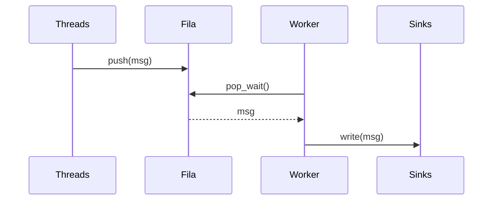

# Arquitetura — Etapa 1 (Chat TCP)

## Visão Geral

O projeto implementa um **chat multiusuário TCP**. Na Etapa 1 foi criada a biblioteca **libtslog** (logging concorrente), um **CLI de estresse** e a base da arquitetura.

## Organização

```
chat-tcp/
?? include/tslog/ (Logger, Sink, ThreadSafeQueue)
?? src/tslog/ (...)
?? apps/log_stress_cli.cpp
?? docs/arquitetura.md
?? logs/
```

## Componentes

* **ThreadSafeQueue**: fila segura com `mutex` + `condition_variable`.
* **Logger**: worker que consome a fila e envia a *sinks*.
* **Sinks**: `StdoutSink` e `FileSink`.
* **CLI de Estresse**: múltiplas threads gravando logs simultaneamente.

## Fluxo do Logger



## Regras de Concorrência

* Locks apenas no tempo mínimo.
* Cada *sink* tem seu próprio `mutex`.
* Evitar logar segurando locks externos.

## Testes

1. Buildar (`cmake .. && make`).
2. Executar `./log_stress_cli`.
3. Conferir saída em terminal e em `logs/app.log`.

## Próximos Passos (Etapa 2–3)

* Servidor TCP concorrente com broadcast.
* Cliente CLI.
* Logs de conexões e mensagens usando libtslog.
